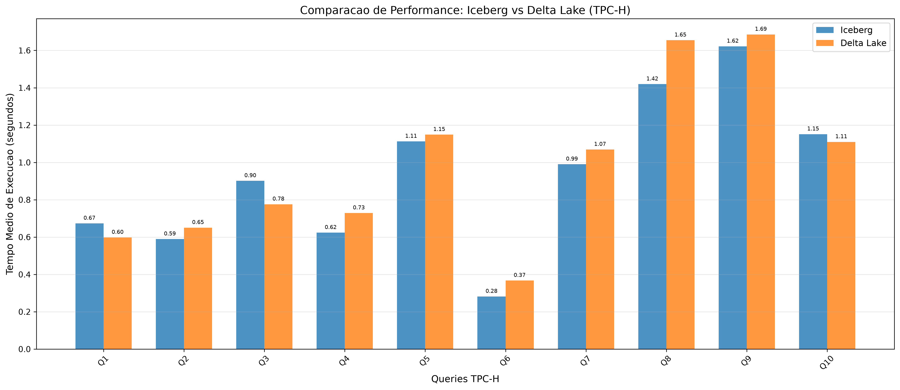
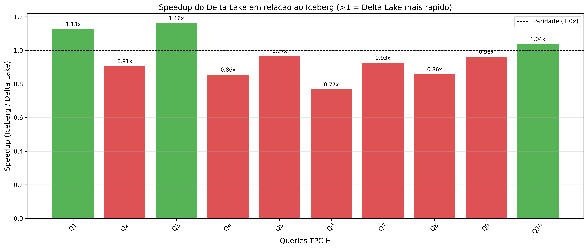
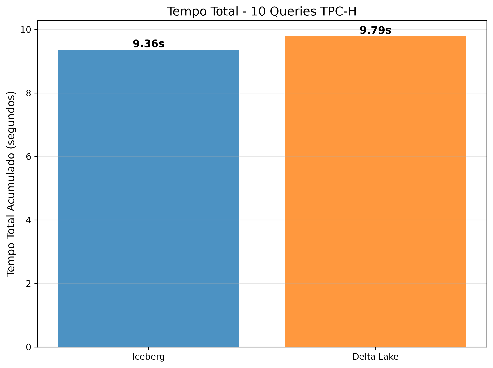

# Automated Lakehouse Orchestration with IaC & Storage Format Benchmark (Iceberg vs Delta Lake)

<p align="center">
  <a href="README.pt-BR.md">🇧🇷 <b>Versão em Português</b></a> | 
  <a href="README.md">🇺🇸 <b>English Version</b></a>
</p>

<p align="center">
  
  
  
  
  
  
  
  
  
</p>

---

## 📌 Overview

This repository provides a complete, automated, reproducible **Infrastructure as Code (IaC)** environment for deploying a modern **Data Lakehouse** architecture on top of a multi-node **Kubernetes (K3s)** cluster.

It features an end-to-end performance benchmarking pipeline comparing the two leading modern table formats: **Apache Iceberg** and **Delta Lake**, queried by **Trino** engine against standardized **TPC-H (Scale Factor 1)** workloads.

Developed as a Bachelor's Dissertation (TCC - *Trabalho de Conclusão de Curso*) project in Computer Engineering / Electrical Engineering at IFPE.

---

## 🏗️ Architecture & Component Topology

The entire infrastructure is provisioned through **Vagrant (VirtualBox)** and configured via **Ansible Playbooks** on a dedicated private network (`192.168.56.0/24`).

```mermaid
graph TD
    subgraph Host["Host Machine"]
        Vagrant["Vagrant CLI & Triggers"]
        Ansible["Ansible Playbook Engine"]
        Bench["Python TPC-H Benchmark Runner"]
    end

    subgraph Cluster["K3s Kubernetes Cluster (lakehouse namespace)"]
        subgraph MasterNode["k3s-master (192.168.56.80)"]
            K3sMaster["K3s Server Control Plane"]
            TrinoCoord["Trino Coordinator (:8080 -> NodePort :30080)"]
        end

        subgraph Worker1["k3s-worker1 (192.168.56.81)"]
            K3sAgent1["K3s Agent (Storage Host)"]
            MinIO["MinIO S3 Storage (Console :30901, API :30900)"]
            PostgreSQL["PostgreSQL 16 (Iceberg JDBC Catalog :30432)"]
            HiveMetastore["Apache Hive Metastore 4.2 (Delta Lake Catalog :9083)"]
        end

        subgraph Worker2["k3s-worker2 (192.168.56.82)"]
            K3sAgent2["K3s Agent (Compute Host)"]
            TrinoWorker["Trino Worker Pod"]
        end
    end

    Vagrant -->|Creates VMs| MasterNode
    Vagrant -->|Creates VMs| Worker1
    Vagrant -->|Creates VMs| Worker2
    Ansible -->|Provisions Cluster & Manifests| Cluster
    Bench -->|Executes TPC-H SQL Queries| TrinoCoord

    TrinoCoord -.->|Iceberg Catalog (JDBC)| PostgreSQL
    TrinoCoord -.->|Delta Lake Catalog (Thrift)| HiveMetastore
    TrinoCoord -.->|Data Query & Ingestion| MinIO
    TrinoWorker -.->|Data Processing| MinIO
```

### Virtual Machine Topology

| Node Name | Role | IP Address | vCPUs | RAM | Base OS |
| :--- | :--- | :--- | :--- | :--- | :--- |
| **`k3s-master`** | K3s Control Plane & Trino Coordinator | `192.168.56.80` | 2 | 2048 MB (2 GB) | Ubuntu 24.04 LTS (Bento) |
| **`k3s-worker1`** | K3s Worker & Storage Services (MinIO, Postgres, Hive) | `192.168.56.81` | 2 | 8192 MB (8 GB) | Ubuntu 24.04 LTS (Bento) |
| **`k3s-worker2`** | K3s Worker & Trino Worker Compute | `192.168.56.82` | 2 | 4096 MB (4 GB) | Ubuntu 24.04 LTS (Bento) |

> **Total Resource Allocation**: 6 vCPUs, ~14.3 GB RAM.

---

## ⚙️ Stack & Services Reference

| Service | Technology & Version | Access Point | Default Credentials | Description |
| :--- | :--- | :--- | :--- | :--- |
| **Query Engine** | Trino `483` | `http://192.168.56.80:30080/ui` | User: `trino` | Distributed SQL query engine |
| **Object Storage** | MinIO `latest` | `http://192.168.56.80:30901` (Console)<br>`http://192.168.56.80:30900` (API) | User: `admin`<br>Pass: `password123` | S3-compatible storage (`warehouse` bucket) |
| **Metadata Catalog** | PostgreSQL `16-alpine` | `192.168.56.80:30432` | User: `admin`<br>Pass: `password123`<br>DB: `iceberg_catalog` | JDBC Catalog for Apache Iceberg & Hive backend |
| **Delta Metastore** | Apache Hive Metastore `4.2.0` | `thrift://hive-metastore.lakehouse.svc:9083` | *N/A (Internal)* | Standalone Hive Metastore for Delta Lake |
| **Kubernetes** | K3s `v1.31.4+k3s1` | `https://192.168.56.80:6443` | *Kubeconfig on Master* | Lightweight certified Kubernetes distribution |

---

## 📊 Lakehouse Catalogs Configuration

Trino is pre-configured with three catalogs:

1. **`tpch`**: Built-in synthetic TPC-H data generator used as the source benchmark dataset (Scale Factor 1, ~1GB).
2. **`iceberg`**:
   - Connector: `iceberg`
   - Catalog Type: `jdbc` (backed by PostgreSQL `iceberg_catalog`)
   - Data Storage: MinIO (`s3://warehouse/`) via S3 path-style access.
3. **`delta_lake`**:
   - Connector: `delta_lake`
   - Metastore: Apache Hive Metastore via Thrift URI.
   - Data Storage: MinIO (`s3a://warehouse/`) via S3 path-style access.

---

## 📋 Prerequisites

Before running the project, ensure you have the following installed on your host machine:

- **Linux** (Ubuntu/Debian, Fedora, Arch, etc.) or **macOS**
- [VirtualBox](https://www.virtualbox.org/) (Version >= 7.0)
- [Vagrant](https://www.vagrantup.com/) (Version >= 2.4)
- **Python 3.10+** with `venv` support
- **Host Hardware**: Minimum 16 GB of RAM and 4 physical CPU cores (6 vCPUs).

---

## 🚀 Quick Start

### 1. Clone the Repository

```bash
git clone https://github.com/marcosbarross/data-lakehouse-benchmark.git
cd data-lakehouse-benchmark
```

### 2. Set Up Python Virtual Environment

Create and activate a virtual environment named `env` (Vagrant is configured to use the Ansible binary located inside this virtual environment):

```bash
python3 -m venv env
source env/bin/activate
pip install --upgrade pip
pip install -r requirements.txt
```

### 3. Provision the Infrastructure

Run `vagrant up`. This will:
1. Download the `bento/ubuntu-24.04` box.
2. Spin up and configure the 3 VMs with static IPs and private networking.
3. Automatically trigger the Ansible playbook to install K3s, configure the cluster, deploy PostgreSQL, MinIO, Hive Metastore, and Trino.

```bash
vagrant up
```

> ⏱️ *The initial provisioning process typically takes around 5 to 10 minutes depending on your internet connection and disk speed.*

### 4. Verify Cluster Health

Check if the VMs are running:
```bash
vagrant status
```

SSH into the master node and inspect the deployed pods:
```bash
vagrant ssh k3s-master
kubectl get nodes -o wide
kubectl get pods -n lakehouse -o wide
exit
```

You should see all pods (`trino-coordinator`, `trino-worker`, `minio`, `postgres`, `hive-metastore`) in `Running` status.

---

## 🧪 Running the TPC-H Benchmark

The repository includes an automated Python benchmarking suite (`benchmark_tpch.py`) that:

1. **Creates Schemas**: Creates `benchmark` schema in both `iceberg` and `delta_lake` catalogs.
2. **Stages & Ingests Data**: Copies all standard TPC-H SF1 tables (`customer`, `orders`, `lineitem`, `part`, `partsupp`, `supplier`, `nation`, `region`) from `tpch.sf1` into both target catalogs on MinIO Parquet storage.
3. **Executes Benchmark Queries**: Executes queries `Q1` through `Q10` across both table formats for 3 iterations each, measuring query latency and resource metrics.
4. **Calculates Statistics**: Computes average execution time, minimum, maximum, standard deviation, and relative speedup.
5. **Generates Visual Plots**: Creates high-resolution charts in `benchmark_plots/`.
6. **Produces Markdown Report**: Automatically compiles the results into `benchmark_report.md`.

### Run the Benchmark

With your virtual environment activated:

```bash
python benchmark_tpch.py
```

---

## 📈 Benchmark Results Summary

*Sample benchmark run on TPC-H SF1 (~1GB) across 10 queries (3 iterations each):*

| Query | Iceberg Average (s) | Delta Lake Average (s) | Relative Speedup (Delta vs Iceberg) | Fastest Format |
| :---: | :---: | :---: | :---: | :---: |
| **Q1** | 0.67s | 0.60s | 1.13x | 🏆 Delta Lake |
| **Q2** | 0.59s | 0.65s | 0.91x | 🏆 Iceberg |
| **Q3** | 0.90s | 0.78s | 1.16x | 🏆 Delta Lake |
| **Q4** | 0.62s | 0.73s | 0.86x | 🏆 Iceberg |
| **Q5** | 1.11s | 1.15s | 0.97x | 🏆 Iceberg |
| **Q6** | 0.28s | 0.37s | 0.77x | 🏆 Iceberg |
| **Q7** | 0.99s | 1.07s | 0.93x | 🏆 Iceberg |
| **Q8** | 1.42s | 1.65s | 0.86x | 🏆 Iceberg |
| **Q9** | 1.62s | 1.69s | 0.96x | 🏆 Iceberg |
| **Q10** | 1.15s | 1.11s | 1.04x | 🏆 Delta Lake |
| **Total Accum.** | **9.36s** | **9.79s** | **-** | 🏆 **Iceberg (4.3% faster)** |

### Visual Comparisons

| Average Query Latency | Relative Speedup | Total Accumulated Time |
| :---: | :---: | :---: |
|  |  |  |

---

## 🛠️ Management & Useful Commands

### Trino Interactive CLI
Access the Trino CLI directly from the cluster:
```bash
vagrant ssh k3s-master -c "kubectl exec -it deploy/trino-coordinator -n lakehouse -- trino"
```

Inside Trino CLI:
```sql
SHOW CATALOGS;
SHOW SCHEMAS FROM iceberg;
SHOW SCHEMAS FROM delta_lake;
SELECT count(*) FROM iceberg.benchmark.lineitem;
SELECT count(*) FROM delta_lake.benchmark.lineitem;
```

### Re-running Ansible Provisioning
If you modify any Ansible role or configuration, reapply without destroying the VMs:
```bash
./env/bin/ansible-playbook -i ansible/inventory/hosts.yml ansible/site.yml
```

### Teardown Infrastructure
To suspend or destroy the virtual machines when done:
```bash
# Suspend VMs to save state
vagrant suspend

# Halt/Stop VMs
vagrant halt

# Completely destroy and clean up VMs
vagrant destroy -f
```

---

## 📁 Repository Structure

```text
.
├── Vagrantfile                         # Multi-node VirtualBox VM topology & provisioning definition
├── requirements.txt                    # Python dependencies (Ansible, Trino DBAPI, Matplotlib, etc.)
├── benchmark_tpch.py                   # Automated TPC-H ingestion, benchmark execution, and reporting
├── benchmark_report.md                 # Markdown benchmark execution report
├── benchmark_plots/                    # High-resolution benchmark comparison charts
│   ├── iceberg_vs_deltalake.png
│   ├── speedup_deltalake_vs_iceberg.png
│   └── total_time_comparison.png
├── ansible/
│   ├── site.yml                        # Main Ansible playbook entrypoint
│   ├── inventory/
│   │   └── hosts.yml                   # Inventory mapping nodes, groups, and SSH keys
│   └── roles/
│       ├── k3s_install/                # K3s master & worker installation and configuration
│       ├── postgres/                   # PostgreSQL catalog deployment manifests & config
│       ├── minio/                      # MinIO S3 storage deployment manifests & bucket setup
│       ├── hive_metastore/             # Apache Hive Metastore service deployment manifests
│       └── trino/                      # Trino Coordinator & Worker deployments and catalog configs
├── utils/
│   └── README.MD                       # Quick commands and node endpoint reference
└── README.pt-BR.md                     # Documentação completa em Português
```

---

## 🎓 Academic Context

This project is part of the undergraduate Final Course Work (TCC - *Trabalho de Conclusão de Curso*) developed by **Marcos Barros** at **Instituto Federal de Educação, Ciência e Tecnologia de Pernambuco (IFPE)**.

- **Title**: *Infraestrutura como Código para Orquestração Automatizada de um Ambiente Lakehouse em Kubernetes* (Infrastructure as Code for Automated Orchestration of a Lakehouse Environment on Kubernetes)
- **Institution**: IFPE - Campus Pesqueira

---

## 📄 License

This project is licensed under the [MIT License](LICENSE) - feel free to use, modify, and distribute for academic and research purposes.
